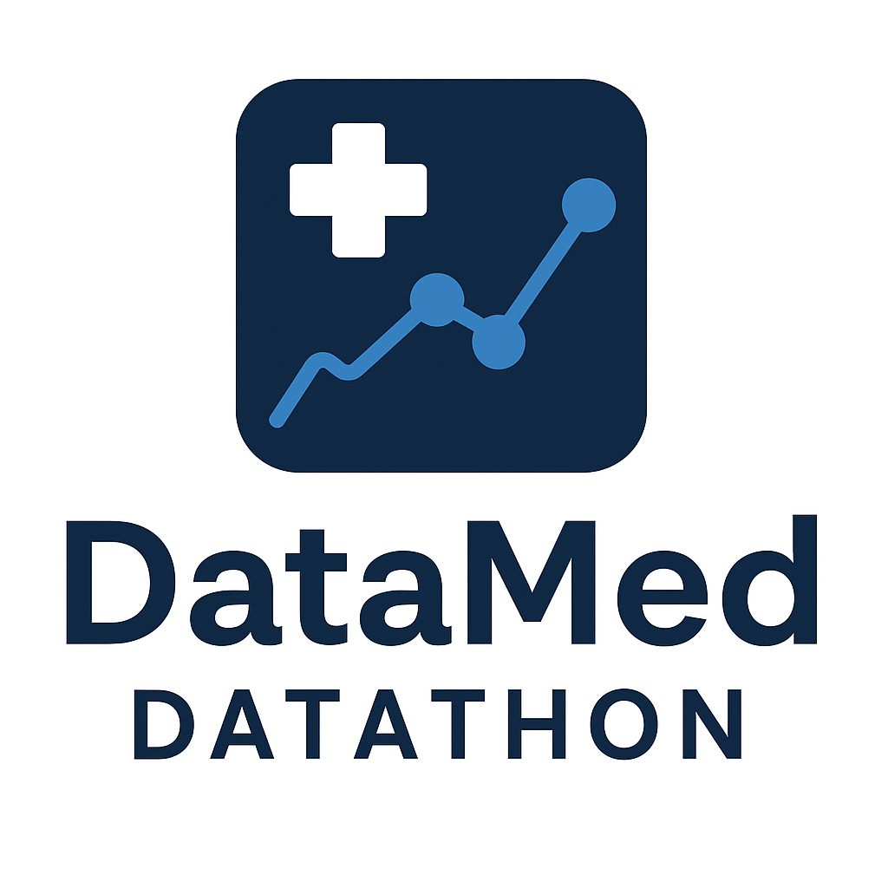

[![LinkedIn][adam-linkedin-shield]][adam-linkedin-url]
[![LinkedIn][swas-linkedin-shield]][swas-linkedin-url]
[![LinkedIn][navneeth-linkedin-shield]][navneeth-linkedin-url]
[![MIT License][license-shield]][license-url]

 

  

<h2 align="center">Datathon 2025</h2>

  

    Team DataMed's submission for the DubsTech Datathon 2025.
     
    <a href="https://github.com/AdamSkog/Datathon-DataMed/issues">Report Bug</a>
    ·
    <a href="https://github.com/AdamSkog/Datathon-DataMed/pulls">Request Feature</a>
  

---

## Table of Contents
- [Table of Contents](#table-of-contents)
- [About the Project](#about-the-project)
  - [Built With](#built-with)
- [Contact](#contact)

## About the Project
Team DataMed's submission for the 2025 Datathon hosted by DubsTech at the University of Washington. We have chosen the prompt of **Health: Drug Overdose in USA** on the Machine Learning track.

### Summary of the Project

We focused on Health: Analyzing the New York State of Health as our prompt for the Datathon. We used the dataset provided by the prompt to analyze the data and build multimple machine learning models to:

- Predict the following for a Specific Hospital and DRG Type for the next 1 year:
  - Discharges
  - Median Costs
  - Median Charges
- Predict the total expected discharges for each DRG Type for the State of New York
- Predict the mean cost of a discharge using features like:
  - Hospital
  - APR DRG code
  - Severity of illness
  - Year
  - Medical/Surgical classification.

#### 1. `meancost.ipynb`
**Mean Cost Prediction of Inpatient Discharges**
This notebook predicts the *Mean Cost* of inpatient hospital discharges based on historical data. It uses features like Facility Name, APR DRG Code, Severity of Illness, and Medical/Surgical Description. Several machine learning models are trained, including Linear Regression, Decision Trees, Random Forests, and XGBoost, to identify trends and minimize discharge costs. The goal is to deliver actionable insights for hospital cost management.

| Metric | XGBoost | Random Forest | Decision Tree | Linear Regression |
|:------|:--------|:--------------|:--------------|:------------------|
| **MAE (Mean Absolute Error)** | 6169.16 (Best) | 7687.41 | 7984.86 | 10624.81 (Worst) |
| **RMSE (Root Mean Squared Error)** | 11298.45 (Best) | 13066.42 | 13461.71 | 16555.23 (Worst) |
| **MSE (Mean Squared Error)** | 1.28×10⁸ (Best) | 1.71×10⁸ | 1.81×10⁸ | 2.74×10⁸ (Worst) |
| **R² Score** | 0.6576 (Best) | 0.5420 | 0.5139 | 0.2648 (Lowest) |
| **Explained Variance Score** | 0.6576 (Best) | 0.5420 | 0.5139 | 0.2648 (Lowest) |
| **Best Params** | `learning_rate=0.0317, max_depth=..., n_estimators=...` | `n_estimators=175, max_depth=10, min_samples_split=5, min_samples_leaf=1` | `max_depth=9, min_samples_split=8, min_samples_leaf=1` | `{}` |

#### 2. `drg_discharge_pred.ipynb`
**DRG Discharge Volume Prediction for New York State**
This notebook forecasts the *total expected discharges* for each Diagnosis-Related Group (DRG) type across New York State. After cleaning and preparing the dataset, it applies machine learning models such as Random Forest, Prophet, XGBoost, and LightGBM. Model performance is evaluated using MAE and RMSE to select the best discharge prediction approach, supporting resource and capacity planning in healthcare settings.

| Metric | Random Forest | Prophet | XGBoost | LightGBM |
|:------|:--------------|:--------|:--------|:---------|
| **MAE (Mean Absolute Error)** | **798.65** (Best) | 1375.26 (Second Best) | ~4800–5000 (High) | ~4800–5000 (High) |
| **RMSE (Root Mean Squared Error)** | **1725.33** (Best) | 3669.35 (Second Best) | 17492.90 (Extremely High) | Not listed (assumed high) |
| **MAPE (Mean Absolute Percentage Error)** | **22.21%** (Best) | 36.17% (Second Best) | >300% (Very High) | >300% (Very High) |

#### 3. `1yearpred.ipynb`
**One-Year Forecast of Hospital Metrics**
This notebook predicts three key metrics, *Discharges*, *Median Costs*, and *Median Charges*, for the next year for a specific hospital and DRG type. Time series models (ARIMA and Auto-ARIMA) are employed to understand historical trends and generate reliable forecasts. These insights assist hospitals in strategic planning, budgeting, and operational management.

| Metric | Predicted Value (2022) | Model Used |
|:-------|:-----------------------|:-----------|
| **Discharges** | 119.74 | ARIMA |
| **Median Cost** | \$11,940.99 | ARIMA |
| **Median Charges** | \$60,310.68 | ARIMA |

### Built With
[![Python][python-shield]][python-url]
[![pandas-shield]][pandas-url]
[![Scikit-Learn][sklearn-shield]][sklearn-url]

## Contact
- Adam Skoglund - @AdamSkog - ajskog@uw.edu
- Swastik Singh - @swassingh - swas@uw.edu
- Navneeth Dhamotharan - @Navneethd8 - nd17@uw.edu

<!-- MARKDOWN LINKS & IMAGES -->
<!-- https://www.markdownguide.org/basic-syntax/#reference-style-links -->
[license-shield]: https://img.shields.io/badge/MIT-red?style=for-the-badge&label=LICENSE
[license-url]: https://github.com/AdamSkog/Scoliosis-Xray-Classification/blob/main/LICENSE

[python-shield]: https://img.shields.io/badge/Python-%233776AB?style=for-the-badge&logo=Python&labelColor=black
[python-url]: https://python.org

[pandas-shield]: https://img.shields.io/badge/-Pandas-blue?style=for-the-badge&logo=pandas&labelColor=black
[pandas-url]: https://pandas.pydata.org/

[sklearn-shield]: https://img.shields.io/badge/-Scikit--Learn-blue?style=for-the-badge&logo=scikit-learn&logoSize=auto&labelColor=black
[sklearn-url]: https://scikit-learn.org/

[adam-linkedin-shield]: https://img.shields.io/badge/adam-linkedin-blue?style=for-the-badge&logo=linkedin&link=https%3A%2F%2Fwww.linkedin.com%2Fin%2Fadam-skoglund%2F
[adam-linkedin-url]: https://linkedin.com/in/adam-skoglund

[swas-linkedin-shield]: https://img.shields.io/badge/swas-linkedin-blue?style=for-the-badge&logo=linkedin&link=https%3A%2F%2Fwww.linkedin.com%2Fin%2Fswassingh%2F
[swas-linkedin-url]: https://www.linkedin.com/in/swassingh/

[navneeth-linkedin-shield]: https://img.shields.io/badge/navneeth-linkedin-blue?style=for-the-badge&logo=linkedin&link=https%3A%2F%2Fwww.linkedin.com%2Fin%2Fnavneeth-dhamotharan%2F
[navneeth-linkedin-url]: https://www.linkedin.com/in/navneeth-dhamotharan/